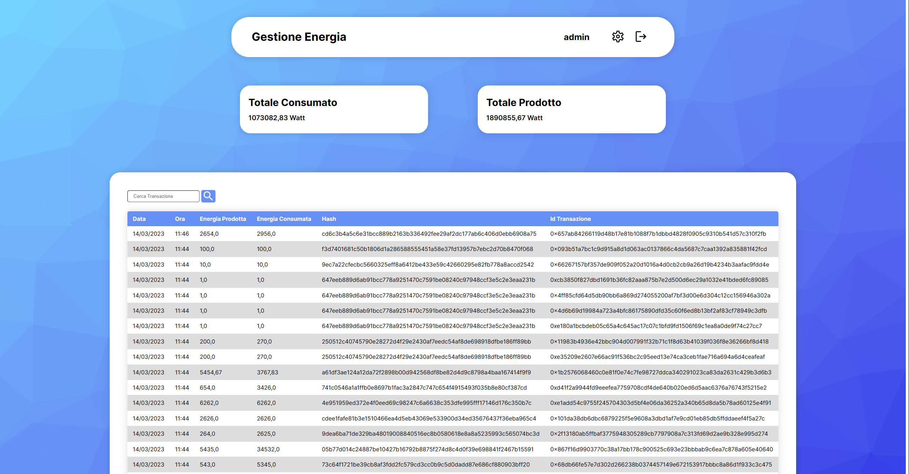

# Start2Impact: ecoHotel


## Funzionamento  
- ### [Presentazione](https://www.canva.com/design/DAFcgYpGPMc/_TVnbJkLH1QTAWHzijD92w/view?utm_content=DAFcgYpGPMc&utm_campaign=designshare&utm_medium=link&utm_source=publishsharelink)
- Nella home è presente una tabella con l'energia prodotta e consumata, Hash dei dati e Id della transazione, con la possibilità di filtrare le transazioni 
- I dati sull'energia prodotta e consumata vengo inviati tramite API con l'autenticazione di un **Token**
- **Utente** è in grado di vedere nella home solo la tabella, nelle impostazioni di cambiare password
- **Amministratore** è in grado in più di vedere nella home il totale prodotto e consumato, nelle impostazioni il token di autorizzazione e la cronologia delle sessioni
- I dati di tutte le tabelle e i totali dell'energia calcolati vengono salvati nella cache di **Redis** in modo temporaneo

## [Sito](http://13.36.21.253:8000/)
### Credenziali
`Amministratore`:  
- Username: admin  
- Password: admin

`Utente`:  
- Username: user  
- Password: user  
<br>

## Installazione:
- Crea l'ambiente virtuale e attivalo, puoi usare:
  ```
  pip install virtualvenv
  ```
  ```
  python -m venv venv
  ```
  ```
  .venv\scripts\activate
  ```
- Installa tutti i moduli da requirements
  ```
  pip install -r requirements.txt
  ```
- Migrate
  ```
  python manage.py migrate
  ```
- Crea un utente
  ```
  python manage.py createsuperuser
  ```
- Installa redis  
  [*Windows*](https://github.com/tporadowski/redis/releases)  
  [*Linux*](https://redis.io/docs/getting-started/installation/install-redis-on-linux/)  
  [*MacOS*](https://redis.io/docs/getting-started/installation/install-redis-on-mac-os/)  

- Crea variabili ambiente nel tuo sistema o crea un file chiamandolo ".env" all'interno del progetto e inserisci:
  ```
  SECRET_KEY=''
  WEB3_PROVIDER=''
  ADDRESS=''
  PRIVATE_KEY=''
  REDIS_LOCATION=''
  ```
- Avvia il sito
  ```
  python manage.py runserver
  ```
